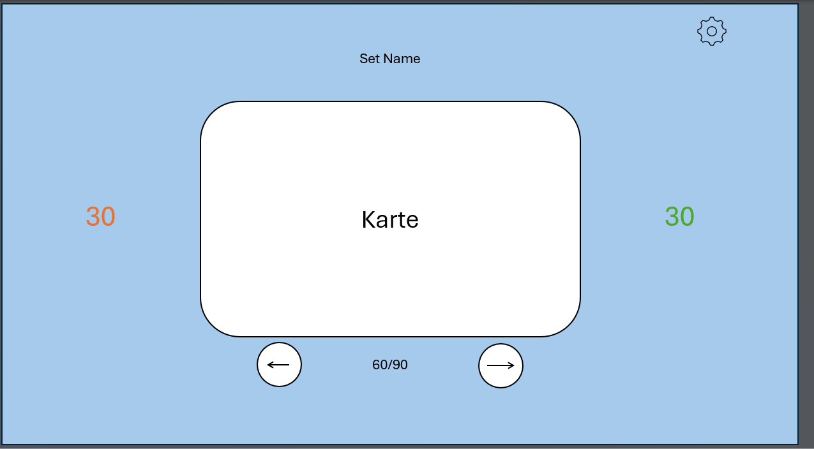
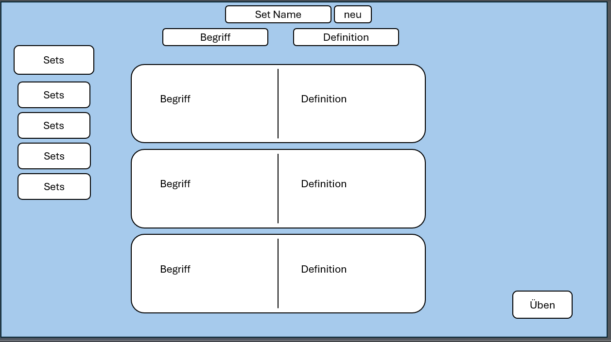

# Planungsdokument: [Temu_Quizlet]

## Teammitglieder
- Luka
- Florian

## 1. Projektbeschreibung
### 1.1 Idee und Ziel
Ein Karteikarten system bei dem die Lernenden Karteikarten lernen können und selber ein Set erstellen.

### 1.2 Kernfunktionen
Man kann Karteikarten selbst erstellen mit einer Vorder und Rückseite. Die Vorderseite wird angezeigt und mit einem Klick auf die Rückseitegewechslet. Die Karteikarten kann man selbst erstellen mit 2 inputs. Die Karten sind in einem Karteikartenset gespeichert. 

## 2. Frontend-Planung
### 2.1 Ansichten
*Beschreibt jede geplante Ansicht/Seite eurer Anwendung. Fügt jeweils den Namen der Ansicht, eine kurze Beschreibung, sowie eine ganz einfache Skizze (Wireframe) ein.*




### 2.2 Datenmodell im Frontend
*Wie sehen eure reaktiven Daten aus? Welche Variablen benötigt ihr? Muss nicht vollständig sein, macht euch aber bereits einige Gedanken darüber und fügt sie im unten stehenden Code-Snippet ein.*

```javascript
// Beispiel
data() {
  return {
    Set: ["Franz voci"],
    Vorderseite: "Ein Geschäft",
    Rückseite: "un magasin",
    erledigt: True
  }
}
```

## 3. Backend-Planung
### 3.1 API-Endpunkte

| Endpunkt | HTTP-Methode | Beschreibung | Request-Body | Response |
|----------|--------------|--------------|--------------|----------|
| /api/Set | GET          | Alle Karteikaarten abrufen | - | Liste von Benutzern |
| /api/add | POST         | Neue Karteikarte hinzufügen | `{name, begriff, definition, erledigt}` | Neue Karteikarte |
| /api/erledigt | put | erledigt auf true machen | - |- |
| /api/set_add | post | neues set hinzufügen | `{set_id,name}` |- |

| ... | ... | ... | ... | ... |

## 4. Datenbankmodell
### 4.1 Tabellen und Beziehungen

*Beschreibt eure Datenbanktabellen und deren Beziehungen zueinander*
In der Datenbank Set wird der Name des Sets gespeichert und eine Id wird hinzugefügt. In der anderen Datenbank wird die Id der Datenbank abgerfen und hat die Einträge für die Karteikarten sowie Eine Spalte um zu sehen ob man die Karte schon kann oder nicht. 

**Tabelle: Karten**


|Set_id| Vorderseit| Rückseite | erledigt |
|------|-----------|-----------|----------|
|  3   | Laden     | magasin   | True     |
|  3   | rot       | rouge     | False    | 
|  3   | grün      | vert      | False    |

**Tabelle: Sets**
| Set_id | Name |
|--------|------|
|   1    | bob  |
|   2    | job  |

## 5. Aufgabenverteilung

*Wer ist für welche Aufgaben hauptverantwortlich?*

| Teammitglied | Hauptverantwortlichkeiten |
|--------------|---------------------------|
| Name 1 | • Frontend-Design<br>• User-Authentication<br>• ... |
| Name 2 | • Backend-Routen<br>• Datenbankintegration<br>• ... |
